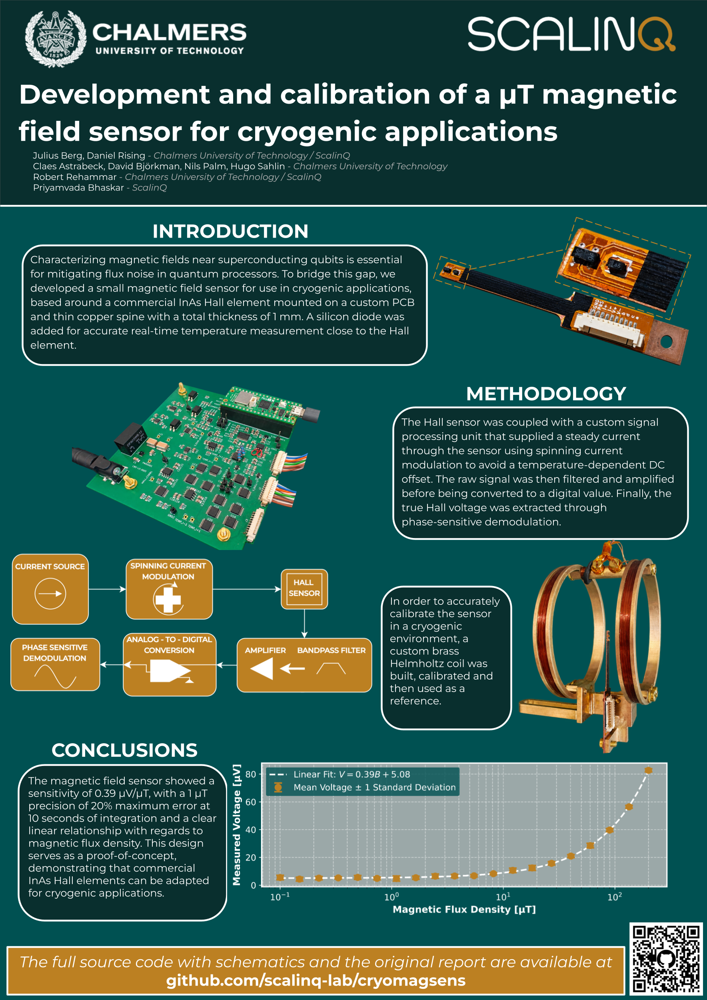

*(Poster from presentation at SQA conference 2026)*

# Cryomagsens

## Project History
This repository is [SCALINQ AB's](https://www.scalinq.com/) continuation of a project that originally began as a Bachelor's Thesis project at the 
 [Department of Microtechnology and Nanoscience at Chalmers University of Technology](https://www.chalmers.se/en/departments/mc2/), 
 in collaboration with SCALINQ AB.

The original proof-of-concept repository can be referenced for historical context [here](
https://github.com/cryomagsens/cryomagsens)

## Description
Cryomagsens is a magnetic field sensor, developed specifically for cryogenic applications. It features a custom sensor 
built around the AKM HQ0811 InAs Hall effect sensor with an integrated temperature sensor and a custom signal processing
unit (SPU), using phase sensitive detection to extract the signal. The signal processing unit is built around the 
Raspberry Pi Pico 2W microcontroller development board, and features hardware support for measurements with 3 different 
sensor units at once.

The system also includes a custom built brass Helmholtz coil for controlled calibration in a cryogenic environment.

All PCB design files for the signal processing unit can be found in `/signal_processing_unit_pcb`, 
and all the PCB design files for the sensor unit can be found in `/sensor_unit_pcb`.

All the mechanical files for the Helmholtz coil and custom PCB mounts can be found in `/mechanical_designs`.

The signal processing unit firmware can be found in `/signal_processing_unit_firmware` and the calibration and test
scripts can be found in `/calibration_scripts`.

## Results
Experimental results show a sensitivity of 0.39 V/T at 5.2 K and 300 µA drive current, with a 20 % relative error at 1 µT.

## Known issues
During work with the project, we have encountered the following problems:

* When running the calibration system at low temperatures, significant self heating occurs. The sensor itself has a low thermal load for currents up to 3 mA through the hall sensor, but thermalizes badly through the brass Helmholtz coil.
* After spinning current demodulation, a significant DC component remains to the signal, corresponding to ~10 µT of signal strenght.
* Uncertain temperature calibration, as mounting point for external temperature sensor is far from the integrated sensor.
* Possible self-induced magnetic fields on the sensor PCB due to signal path asymmetry.

The following is a list of non implemented features.
* No check for current source saturation (even though the signal processing unit has hardware support for such a check)
* No way to load calibration data to the SPU. Right now the SPU returns a voltage instead of a magnetic flux density.
* PCB design mistakes (fixed in the PCB design files but visible in the pictures).

The following is a list of proposed changes:
* Implement way to disable/enable current sources to the Hall element and diode independently without interfering with the ADC.
* Invert the connector signals (J1 - J3 on the signal processing unit PCB - Would make the cables bidirectional even when GND and PRS lines aren't shielded).
* Protect the sensitive signals between ground layers during the full signal path.   

## Licensing
This repository contains both software and hardware design files, licensed separately:

- All software (located in `/signal_processing_unit_firmware` and `/calibration_scripts`) is licensed under the MIT License. See [LICENSE-MIT](LICENSE-MIT).

- All hardware design files (PCB Schematics, Layouts, 3D CAD models, etc.) (located in `/mechanical_designs`, `/sensor_unit_pcb`, and `/signal_processing_unit_pcb`) are licensed under the CERN Open Hardware Licence Version 2 - Permissive. See [LICENSE-CERN-OHL-P](LICENSE-CERN-OHL-P).
