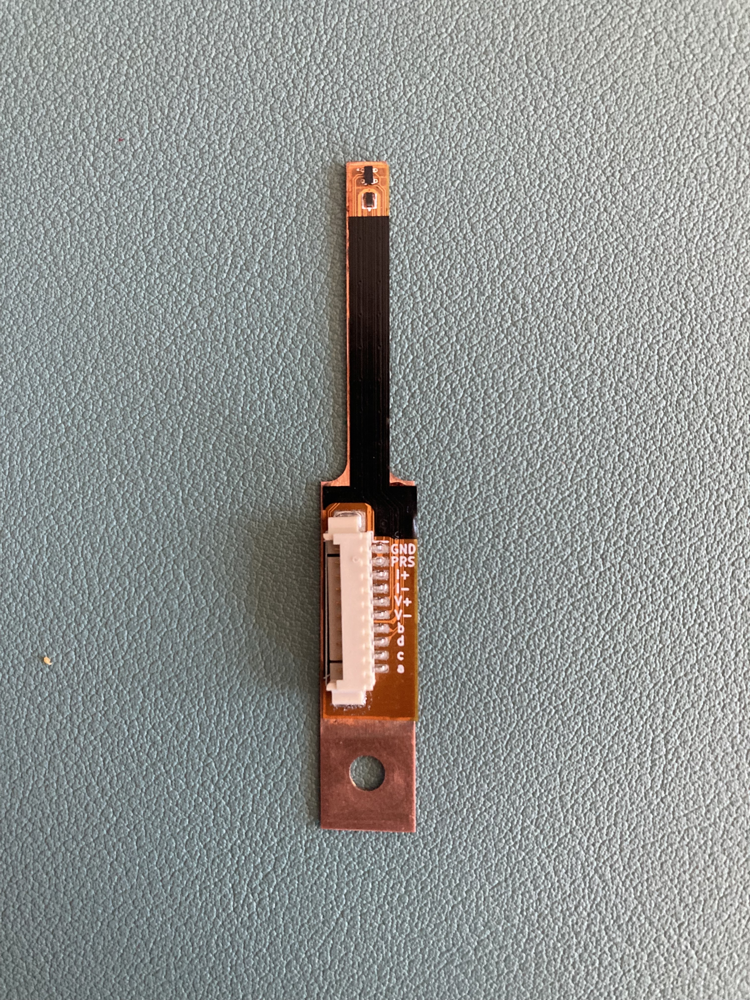

# Sensor unit: Schematics and PCB Design

*(Sensor unit)*

## Design

The sensor unit was designed in KiCad 10 and manufactured by JLCPCB. It is built in a flex PCB material to achieve 
a very small build height, in order to come very close to the device under test. The Flex PCB is mounted to a copper 
spine (see `..\mechanical_designs` for the full design) for thermalisation purposes. The total build height of the sensor unit is 1.1 mm.

The sensor unit features a AKM HQ0811 InAs Hall element as a magnetic field sensor, a 1N4148 Si diode as a temperature sensor and a 10-pin Molex PicoBlade connector for a good and stable connection.

## Working principle

### Hall sensor
The Hall element has four nodes, here denoted *a, b, c, d*. When a current is pushed fron *a* to *c*, a potential difference can be measured between *b* and *d*, which scales linearly with the applied orthogonal magnetic flux density.
When a current is pushed from *b* to *d*, a similar potential difference can be measured between *a* and *c*.
By modulating the current directiion and through which axis the current is pushed, the remaining DC offset due to asymmetries in the element can be eliminated.

### Diode temperature sensor
The sensor unit also features a 4-wire measurement setup for the diode, which acts as a temperature sensor.
The nominal drive current of the diode is 10 µA.

### Presence pin.
The sensor unit features a presence pin *(denoted PRS)*, which is internally connected to the ground pin on the sensor PCB.
When connected to the signal processing unit, a GPIO pin is pulled low through the sensor unit, indicating that 
a sensor is connected and allowing current output.
