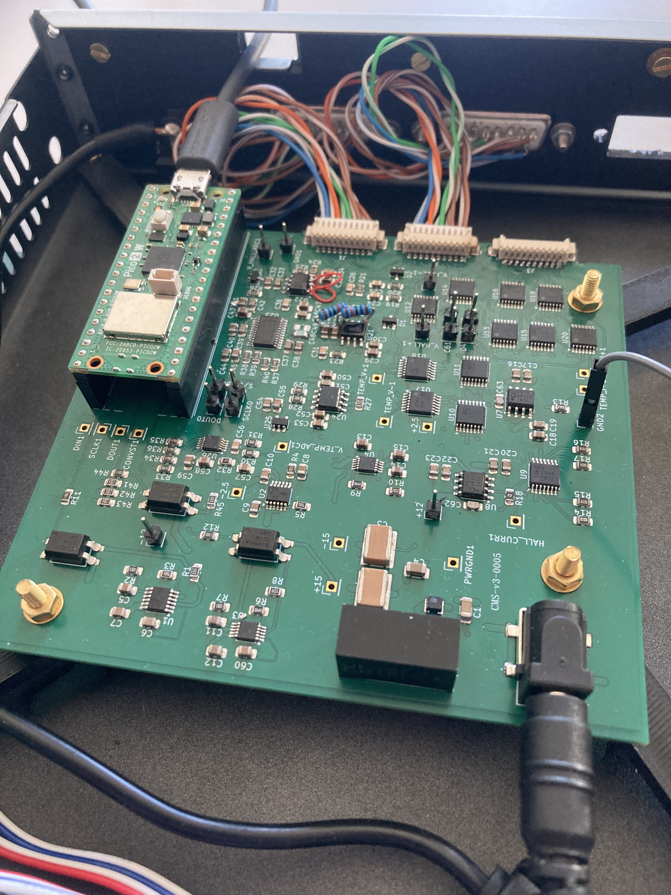

# Signal Processing Unit: Schematics and PCB Design

*(Assembled signal processing unit)*

## Design

The signal processing unit *(SPU)* was designed in KiCad 10 and manufactured by JLCPCB. It is based around the Raspberry Pi Pico 2W development board and features hardware support for simultaneous magnetic field measurements from three separate cryomagsens sensor units. 

The SPU supports both USB and WiFi interfacing and is physically grounded to the chassis to minimize noise. Custom 3D models for components outside of the standard KiCad libraries were sourced from the SamacSys Library Loader.

## Cabling

The board features three 10-pin Molex PicoBlade connectors. These route to external 15-pin D-sub connectors on the enclosure to ensure a secure physical connection.

## Known Issues 

There are three known design mistakes on the physical PCB shown above. **Note:** All three issues have been corrected in the provided KiCad schematic and PCB design files.

